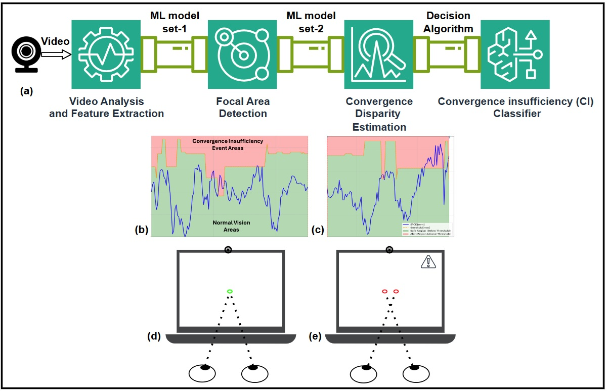

# CIMA: Convergence Insufficiency Monitoring and Alerting System
**Convergence Insufficiency (CI)** is a binocular vision disorder causing difficulty maintaining eye convergence on near objects, leading to symptoms like eye fatigue, double vision, and headaches. The Convergence Insufficiency Monitoring and Alerting (CIMA) system is a real-time computer vision solution that uses a webcam and machine learning to detect abnormal eye convergence and alert users, aiming to reduce symptoms and enhance user well-being and productivity during extended computer use.
## About The Project

<figure>
  
  <figcaption>Illustration of the proposed Convergence Insufficiency (CI) Monitoring and Alerting (CIMA) system.
(a) System signal flow during analysis, illustrating a multi-stage classification architecture that includes video analysis and feature extraction, focal area estimation, convergence disparity estimation, and decision mechanism; (b), (c) The proposed Screen-Plane Convergence Disparity (SPCD) measure (blue line), used for CI classification: SPCD values below the calibrated threshold (green area) indicate sufficient convergence, while values above it (red area) indicate insufficient convergence; (d), (e) Examples of eye convergence states corresponding to sufficient and insufficient convergence, respectively. Frequent occurrences of insufficient convergence events within the detection window (demonstrated in (c)) trigger an alert to the user.</figcaption>
</figure>

Currently, there are no consumer-level tools that provide real-time monitoring for CI events. CIMA was developed as a proof-of-concept (POC) to fill this gap. It is an innovative, software-only solution that uses a standard laptop webcam to:
1.  Track the user's eye movements in real-time.
2.  Calculate a key metric called **Screen-Plane Convergence Disparity (SPCD)** to quantify eye convergence.
3.  Use a machine learning pipeline to detect patterns of insufficient convergence.
4.  Trigger a simple alert, prompting the user to rest their eyes and prevent worsening symptoms.

The ultimate goal of this project is to enhance digital well-being and provide a practical tool for the millions of computer users affected by CI.

### Key Features

*   **Real-time Eye Tracking:** Uses Google's MediaPipe to generate a 3D facial mesh and track pupil location with high accuracy.
*   **Convergence Insufficiency (CI) Detection:** Implements a two-stage machine learning pipeline (using LightGBM) to predict the user's focal area and their SPCD value.
*   **Dynamic User Calibration:** Performs a personalized calibration for each user to set custom thresholds for CI detection, improving accuracy and reducing false positives.
*   **User Alerts:** Provides a simple pop-up notification when frequent CI events are detected, advising the user to take a break.
*   **Data Analysis & Visualization:** Includes a comprehensive GUI built with Tkinter for system calibration, data collection, and analysis of results.
*   **Hardware-Independent:** Requires no special hardware beyond a standard webcam found in most laptops.

### Built With

This project was built using the following core technologies:

*   [Python](https://www.python.org/)
*   [OpenCV](https://opencv.org/)
*   [MediaPipe](https://github.com/google-ai-edge/mediapipe)
*   [LightGBM](https://lightgbm.readthedocs.io/en/latest/)
*   [Tkinter](https://docs.python.org/3/library/tkinter.html)
*   [NumPy](https://numpy.org/)
*   [Pandas](https://pandas.pydata.org/)
*   [Scikit-learn](https://scikit-learn.org/)

## Getting Started

To get a local copy up and running, follow these simple steps.

### Prerequisites

Make sure you have Python (version 3.9 or higher) and pip installed on your system.

### Installation

1.  **Clone the repository:**
    ```sh
    git clone https://github.com/amitg-git/CIMA.git
    ```
2.  **Navigate to the project directory:**
    ```sh
    cd CIMA
    ```
3.  **Create and activate a virtual environment (recommended):**
    *   On Windows:
        ```sh
        python -m venv venv
        .\venv\Scripts\activate
        ```
    *   On macOS/Linux:
        ```sh
        python3 -m venv venv
        source venv/bin/activate
        ```
4.  **Install the required packages from `requirements.txt`:**
    ```sh
    pip install -r requirements.txt
    ```

## Usage

To run the application, execute the main script from the project's root directory:

```sh
python main.py